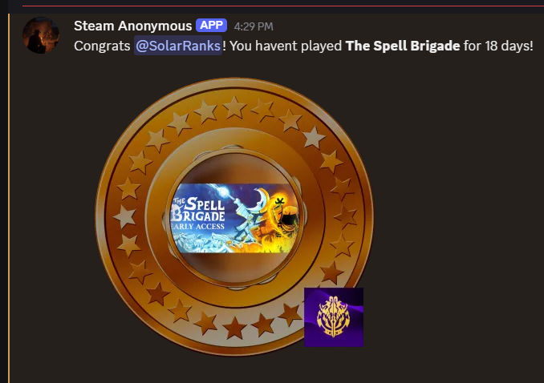
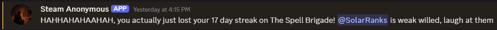

# Steam Anonymous

This is a Discord Bot that uses the Steam API to track registered users and hand out "tokens" representing how long they were away from certain games. Dont fall back to old habbits, youre better than League.

## Commands
`/ping` - Test the conectivity of the bot

`/track` - Setup a tracker on a game for a specific steam user

`/track @user` - Attach a Steam ID to a user for ease of use. Future uses will fill out the Steam ID automatically

`/untrack` - Remove a tracker on a game for a specific steam user

`/untrack @user` - Remove a tracker on a game for the specified user (must have /track @user setup)

`/subscribe` - Subscribe your Guild to the current channel, all future messages will be sent here

`/assign @user` - Attach a Steam ID to a user for ease of use. Leaving it blank will result in the user being unassigned.

## "Quick" Server Setup

 - Clone this repository on your server
 - In the new directory run `$ npm i`
 - From the Discord and Steam websites, register for use of their API.
 - Create a .env file and set the `DISCORD_TOKEN`, `DISCORD_CLIENT_ID`, and `STEAM_KEY`

 This should be enough to get it running.

### Additional Setup (for personalization)

Within config.ts there should be a few variables you could mess around with such as:

 - `crontabUpdater` - Change how frequently the server sends out updates to the tracked users. See [crontab examples](https://crontab.guru/examples.html)

Within the txt folder, you can edit the files to however you please

 - `chirp.txt` - randomly selected phrases to demonstrate dissapointment for anyone who breaks a streak. Key tokens include:
    - `$u` - the user
    - `$g` - the game
    - `$d` - streak lost (in days)

Any Token visuals can be changed within `img/tokens/`. The `front` and `back` folders representing a graphic over and under the game visual respectively.

 ## Run

 - `$ npm run dev`

 ## Images

 

 

 

